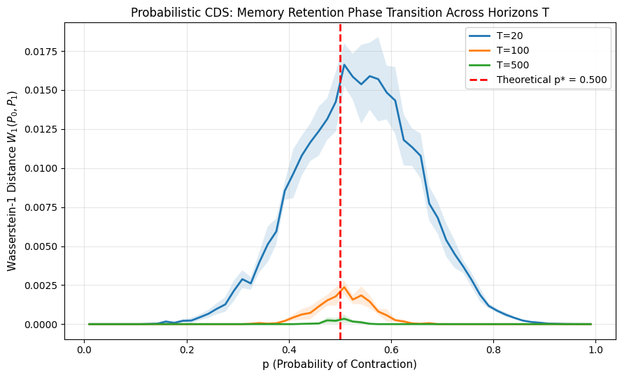
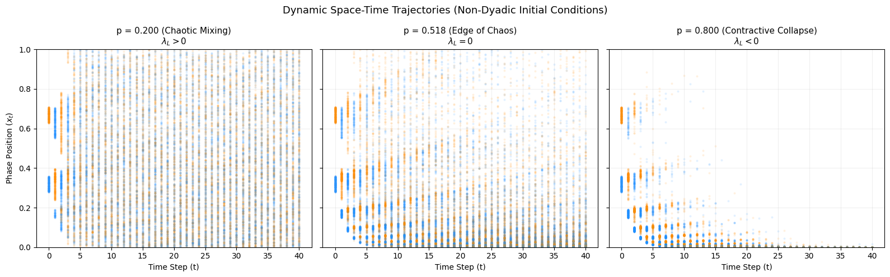
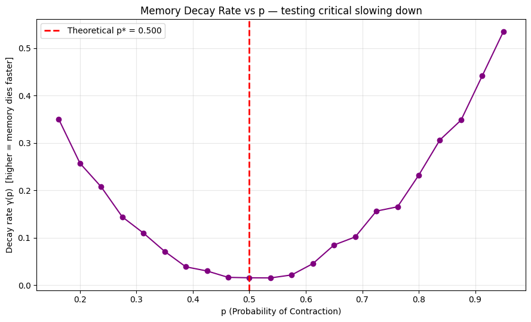
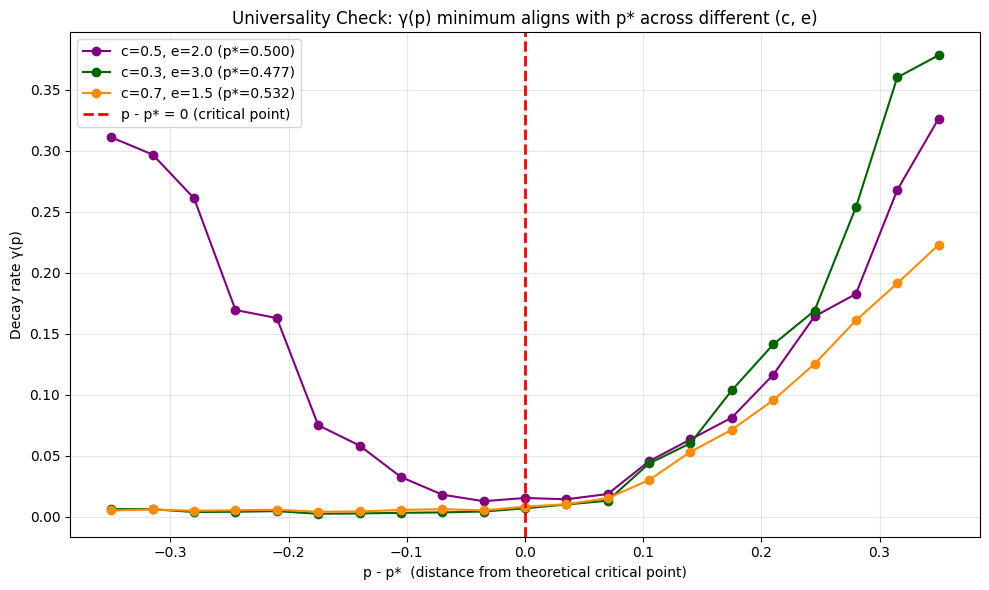

# Probabilistic CDS: Memory, Chaos, and the Edge Between Them

*A toy model exploring what happens when you replace deterministic dynamics with probabilistic axioms — and where memory actually lives in a system that's neither fully ordered nor fully chaotic.*

**TL;DR:** A simple probabilistic dynamical system has an exact, closed-form point where chaos and collapse exactly balance. Memory of an initial condition survives dramatically longer right at that point than anywhere else — roughly 20–30x slower decay — and this holds across multiple independent parameter choices, not just one lucky setup.

## Motivation

Cotler & Rezchikov's *Computational Dynamical Systems* (CDS) builds its apparatus on **deterministic** maps: `x_{t+1} = f(x_t)`. Even though the system is fully determined, an *observer* with bounded compute often can't predict its future — not because of randomness, but because simulating the rule forward can be computationally irreducible. That observer-boundedness is the seed of a broader idea I keep returning to across this work: hardness isn't a fixed property of a problem, it's relative to who's trying to solve it and with what resources.

This project asks a simple follow-up question CDS doesn't: **what happens if the dynamics themselves are probabilistic, not deterministic?** Instead of one fixed rule, every step is a coin flip between two very different fates. Where does memory survive, and where does it die — and does it die the same way everywhere, or in fundamentally different ways depending on which side of a threshold you're on?

## The Model

We replace `f: X → X` with a **random iterated function system (IFS)** on the unit circle `[0,1)` (wraparound via mod 1, so nothing runs off to infinity):

- **Contracting move** (probability `p`): `x_{t+1} = c·x_t mod 1`, where `0 < c < 1`
- **Expanding move** (probability `1-p`): `x_{t+1} = e·x_t mod 1`, where `e > 1` (a generalized doubling map — the textbook example of chaos)

At every timestep, flip a biased coin and apply one move or the other.

### Theorem: exact closed-form Lyapunov exponent

The Lyapunov exponent measures how fast nearby trajectories separate on average:

```
λ_L = lim(T→∞) (1/T) · Σ ln|f'(x_t)|
```

For general nonlinear systems this requires integrating over an invariant measure — often intractable in closed form. But because both our maps are **affine**, the derivative is a *constant* (`c` or `e`) regardless of state. That collapses the whole thing into a sequence of i.i.d. Bernoulli draws, and by the law of large numbers:

```
λ_L = p·ln(c) + (1-p)·ln(e)
```

Exact, not approximate. Solving `λ_L = 0` gives a closed-form critical probability:

```
p* = ln(e) / (ln(e) - ln(c))
```

This is the "hydrogen atom" of the model — a non-trivial dynamical system where the edge of chaos isn't estimated numerically, it's derived on paper and then handed to a random number generator to confirm.

### Why p* matters: the edge-of-chaos hypothesis

- `λ_L > 0` (past `p*`, expansion-dominated): trajectories diverge exponentially — **chaotic folding**. Information gets stretched and wrapped over itself until it looks like uniform noise.
- `λ_L < 0` (past `p*`, contraction-dominated): trajectories converge — **attractor collapse**. Distinct starting points get squeezed toward the same point until they're indistinguishable.
- `λ_L ≈ 0` (right at `p*`): neither dominates. This is the contested but well-known **"edge of chaos"** hypothesis from complexity science (Langton, Packard, Crutchfield) — the idea that useful computation and memory require sitting exactly on this knife-edge, since pure order can't hold new information and pure chaos can't preserve old information.

Critically: these are **two structurally different erasure mechanisms**, not two flavors of the same thing. One is over-mixing; the other is over-forgetting. This model gives you a dial (`p`) that moves you continuously through both, with an exact, known coordinate for where they balance.

## Experiments and Results

### 1. Does the system encode and lose a bit of information?

We start two populations of trajectories at `x_0 = 0.25` (bit 0) and `x_0 = 0.75` (bit 1), run them forward `T` steps under the random dynamics, and ask: can you still tell which population a trajectory came from just by looking at `x_T`?

Measured via the **1D Wasserstein-1 distance** `W_1(P_0, P_1)` between the two resulting distributions — literally, how much "work" it takes to morph one distribution into the other. We use this instead of a simple mean/variance ratio (`d'`) because `d'` breaks down badly in both extreme regimes: it explodes near-`p=1` (variance underflows toward zero as the dynamics turn near-deterministic) and implicitly assumes unimodal, Gaussian-shaped distributions, which folded/wrapped distributions are not.

**Result:** `W_1` traces a clean, smooth peak centered exactly on the theoretical `p*`, across multiple time horizons (T=20, 100, 500). Away from `p*`, the peak collapses toward zero increasingly fast as `T` grows — by `T=500`, only a narrow window around `p*` retains any detectable signal at all.



To see this qualitatively rather than just as a summary statistic, the figure below tracks full trajectories over time (not just the endpoint) for three values of `p` — chaotic, critical, and contracting. The visual difference in texture is the same phase transition, seen as a process rather than a number:



### 2. Critical slowing down: does memory decay slower right at the threshold?

For each `p`, we track `W_1` across a range of horizons `T ∈ {10, 20, ..., 320}` and fit an exponential decay rate `γ(p)` from the slope of `log(W_1)` vs `T`.

**Result:** `γ(p)` forms a clean V-shape, with its minimum landing exactly at `p*`. At the edges of the tested range, decay rates run roughly **20–30x higher** than right at the critical point — meaning memory of the initial bit survives dramatically longer near criticality than anywhere else. This is the empirical signature of **critical slowing down**, a well-known phenomenon from statistical physics phase transitions, showing up here in a from-scratch discrete stochastic system.



### 3. Universality: is this specific to one choice of (c, e)?

We reran the full `γ(p)` sweep for three independent parameter pairs — `(c=0.5, e=2.0)`, `(c=0.3, e=3.0)`, `(c=0.7, e=1.5)` — each with its own distinct theoretical `p*` (0.500, 0.477, 0.532 respectively).

**Result:** plotting `γ` against `p - p*` (distance from each config's own critical point) collapses all three curves' minima onto the same location: zero. Different microscopic contraction/expansion strengths, same critical location, same qualitative V-shape — just different steepness. This is the actual signature of **universality** in the physics sense: the location of a phase transition is a structural property of the system class, not an artifact of one parameter choice.



### 4. The critical exponent — and an honest surprise

Fitting `γ(p) ~ A·|p - p*|^α` in log-log space across the full window gave `α ≈ 1.08` — but a closer look at the data revealed something more interesting than a clean power law.

**Within a narrow band around `p*` (|p - p*| < 0.03), `γ(p)` stops decreasing and plateaus** rather than continuing to fall toward zero. This isn't noise — it's a real artifact of the fitting method meeting real physics: `decay_rate_at_p` assumes *exponential* decay (a straight line in log-space), but right at true criticality, theory predicts decay becomes **polynomial**, not exponential. Forcing an exponential fit onto genuinely polynomial decay produces an apparent floor, bounded by the largest `T` tested (320) — a "shadow" of sub-exponential decay showing through an exponential-shaped ruler.

Excluding this plateau region and refitting on the genuinely exponential-decay regime (`0.03 < |p - p*| < 0.15`) gives a tighter, more honest estimate: **α ≈ 0.86** (n=12 points, some scatter — best read as "consistent with α ≈ 0.85–1" rather than a precise decimal).

So the full, honest result is two-part, not one clean number:
- **Away from criticality:** decay rate scales as `γ(p) ~ |p-p*|^0.86`, roughly linear
- **At criticality:** decay transitions from exponential to (apparently) sub-exponential/polynomial — the plateau itself is evidence of this regime change, not a nuisance to be fitted away


## Why this matters to me

This connects to a thread that runs through everything else I'm working on. My UARD framework treats reward-model reliability as something to be *discounted*, not trusted outright — because the "true" objective a reward model is meant to approximate isn't a fixed, observer-independent target. My essay on ELK frames the failure as a structurally ill-posed inverse problem, for the same underlying reason: there's no single ground truth to invert toward. My observer-relative hardness thesis says computational hardness itself isn't intrinsic to a problem, it's relative to the observer's compute and information.

This toy model is the same idea in a different costume: **the boundary between "memory survives" and "memory is destroyed" is not one boundary, it's two structurally different failure modes (folding vs. collapse) meeting at a single, exactly-computable point** — and the closer you sit to that point, the harder it becomes to say, in finite time, which side you're actually on. That's not just a cute dynamical-systems fact. It's a small, concrete instance of the same epistemic structure I think shows up everywhere in alignment and evaluation: verification, hardness, and memory are all things that look binary from far away and turn out to be continuous, fragile, and observer-relative up close.

## What would change my mind

Worth stating plainly what would count as evidence against the claims above, not just evidence for them:

- **On universality:** if a fourth `(c, e)` pair — especially one with a very different contraction/expansion ratio than the three tested — showed its decay-rate minimum sitting somewhere other than its own theoretical `p*`, that would undercut the universality claim. Right now three configs agreeing could still be a small-sample coincidence.
- **On the plateau being a real exponential→polynomial crossover:** if directly fitting `W_1(T) ~ T^-β` at exactly `p = p*` failed to show a clean power law — e.g., if the plateau instead turned out to just be a finite-`T` ceiling artifact (decay is still exponential, just too slow to resolve within `T=320`) — the "qualitative regime change" interpretation would need to be walked back to a weaker claim: decay is *merely much slower* at criticality, not *categorically different in kind*.
- **On the critical exponent (α≈0.86):** this rests on only 12 points. A denser, independently-seeded rerun landing meaningfully outside the 0.7–1.0 range would mean the current estimate was noise, not signal.
- **On the whole framing being useful at all:** if none of this transfers to higher-dimensional or nonlinear random dynamical systems — if it turns out to be a peculiarity of 1D affine maps specifically — the "hydrogen atom" framing would need revising from "minimal instance of a general phenomenon" down to "a clean but narrow special case."

## Honest limitations

- All results are from a single, simple affine two-map system. Whether this generalizes to higher-dimensional or nonlinear random dynamical systems is untested.
- The critical exponent estimate (α ≈ 0.86) rests on a small number of points (n=12) after excluding the plateau — worth tightening with a larger, more targeted sweep before treating it as a precise number.
- The plateau interpretation (exponential → polynomial decay crossover) is a plausible, theory-consistent explanation of the data, not yet independently confirmed by directly fitting a polynomial decay law in `T` at exactly `p*`.

## Next steps

- [ ] Directly fit polynomial decay (`W_1(T) ~ T^-β`) at exactly `p = p*`, to independently confirm the exponential→polynomial crossover rather than inferring it from the plateau artifact
- [ ] Tighten the critical exponent estimate with a denser, wider sweep of `(c, e)` configurations
- [ ] Extend to higher-dimensional random IFS (2D+ phase space) to test whether the same universality holds outside 1D
- [ ] Explore the probabilistic-shadowing question directly: does the sequence of probability measures `μ_t` stay within bounded Wasserstein distance of an idealized Markov chain, and does *that* distance also exhibit critical behavior at `p*`?
- [ ] Write this up properly as a short, self-contained note — separate from CodeHack-Eval, since it's a different kind of contribution (theoretical/simulation vs. empirical eval pipeline)
- [ ] **A sharper deterministic analog.** A related experiment replacing per-step randomness with a fixed, deterministic arrangement of contracting/expanding steps (same total ratio `p`, no coin flips) shows the same critical point `p*` — but as a near-singular spike rather than the smooth, broad peak seen in the stochastic version. This suggests the randomness in the probabilistic model isn't incidental to the results above — it's actively smoothing what would otherwise be a much sharper, more fragile transition. Worth exploring further as a direct comparison between stochastic and deterministic critical behavior in this system class.

## Reproducing this

All experiments are pure NumPy/Matplotlib, no GPU or external API needed — runs on a plain Google Colab CPU runtime in a few minutes (roughly 15 minutes total for the full experiment set, including the universality sweep). Full code is in [`probabilistic_cds_experiments.ipynb`](probabilistic_cds_experiments.ipynb).

**Dependencies:** `numpy`, `matplotlib` — no exotic or version-pinned packages required; any reasonably recent version of either should work.
